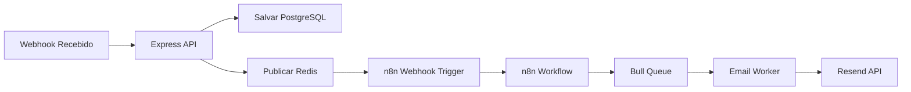

# n8n Workflows - Recovery SaaS

## 🔄 Visão Geral da Integração

### Arquitetura n8n + Recovery SaaS


## 📋 Workflows Principais

### 1. Abandoned Cart Flow
**ID**: `abandoned-cart-recovery`  
**Trigger**: Webhook POST `/webhook/n8n/abandoned-cart`

```json
{
  "name": "Abandoned Cart Recovery",
  "nodes": [
    {
      "parameters": {
        "httpMethod": "POST",
        "path": "abandoned-cart",
        "responseMode": "responseNode",
        "options": {}
      },
      "name": "Webhook Trigger",
      "type": "n8n-nodes-base.webhook",
      "position": [250, 300],
      "webhookId": "abandoned-cart-webhook"
    },
    {
      "parameters": {
        "conditions": {
          "number": [
            {
              "value1": "={{$json[\"data\"][\"total_price\"]}}",
              "operation": "larger",
              "value2": 100
            }
          ]
        }
      },
      "name": "Check Cart Value",
      "type": "n8n-nodes-base.if",
      "position": [450, 300]
    },
    {
      "parameters": {
        "operation": "executeQuery",
        "query": "SELECT * FROM customers WHERE email = '{{$json[\"data\"][\"customer\"][\"email\"]}}' AND organization_id = '{{$json[\"organization_id\"]}}'",
        "options": {}
      },
      "name": "Get Customer History",
      "type": "n8n-nodes-base.postgres",
      "position": [650, 200],
      "credentials": {
        "postgres": {
          "id": "neon-recovery-db",
          "name": "Neon Recovery DB"
        }
      }
    },
    {
      "parameters": {
        "functionCode": "// Calcular delays baseado no histórico\nconst customer = items[0].json;\nconst isVip = customer.total_purchases > 1000;\nconst isFirstTime = customer.purchase_count === 0;\n\nlet delays = [120, 1440, 4320]; // 2h, 24h, 72h em minutos\n\nif (isVip) {\n  delays = [60, 720, 2880]; // 1h, 12h, 48h\n} else if (isFirstTime) {\n  delays = [30, 360, 1440]; // 30min, 6h, 24h\n}\n\nreturn [\n  {\n    json: {\n      ...items[0].json,\n      email_delays: delays,\n      customer_segment: isVip ? 'vip' : isFirstTime ? 'new' : 'regular'\n    }\n  }\n];"
      },
      "name": "Calculate Delays",
      "type": "n8n-nodes-base.function",
      "position": [850, 300]
    },
    {
      "parameters": {
        "url": "={{$env.RECOVERY_API_URL}}/internal/queue/schedule",
        "authentication": "headerAuth",
        "method": "POST",
        "bodyParameters": {
          "parameters": [
            {
              "name": "event_id",
              "value": "={{$json[\"id\"]}}"
            },
            {
              "name": "event_type",
              "value": "ABANDONED_CART"
            },
            {
              "name": "delays",
              "value": "={{$json[\"email_delays\"]}}"
            },
            {
              "name": "customer_segment",
              "value": "={{$json[\"customer_segment\"]}}"
            }
          ]
        },
        "options": {}
      },
      "name": "Schedule Emails",
      "type": "n8n-nodes-base.httpRequest",
      "position": [1050, 300],
      "credentials": {
        "httpHeaderAuth": {
          "id": "recovery-internal-api",
          "name": "Recovery Internal API"
        }
      }
    },
    {
      "parameters": {
        "values": {
          "string": [
            {
              "name": "status",
              "value": "success"
            },
            {
              "name": "scheduled_emails",
              "value": "={{$json[\"email_delays\"].length}}"
            }
          ]
        },
        "options": {}
      },
      "name": "Response",
      "type": "n8n-nodes-base.set",
      "position": [1250, 300]
    }
  ],
  "connections": {
    "Webhook Trigger": {
      "main": [
        [
          {
            "node": "Check Cart Value",
            "type": "main",
            "index": 0
          }
        ]
      ]
    },
    "Check Cart Value": {
      "main": [
        [
          {
            "node": "Get Customer History",
            "type": "main",
            "index": 0
          }
        ],
        [
          {
            "node": "Response",
            "type": "main",
            "index": 0
          }
        ]
      ]
    },
    "Get Customer History": {
      "main": [
        [
          {
            "node": "Calculate Delays",
            "type": "main",
            "index": 0
          }
        ]
      ]
    },
    "Calculate Delays": {
      "main": [
        [
          {
            "node": "Schedule Emails",
            "type": "main",
            "index": 0
          }
        ]
      ]
    },
    "Schedule Emails": {
      "main": [
        [
          {
            "node": "Response",
            "type": "main",
            "index": 0
          }
        ]
      ]
    }
  }
}
```

### 2. Bank Slip Expired Flow
**ID**: `bank-slip-expired-recovery`  
**Trigger**: Webhook POST `/webhook/n8n/bank-slip-expired`

#### Nodes Principais:
1. **Webhook Receiver**: Recebe evento de boleto expirado
2. **Check Business Hours**: Verifica se é horário comercial
3. **Generate New Bank Slip**: Chama API para gerar novo boleto
4. **Generate PIX**: Cria QR Code PIX alternativo
5. **Prepare Email Data**: Monta dados para email
6. **Schedule Immediate Email**: Envia primeiro email imediatamente
7. **Schedule Follow-ups**: Agenda emails de follow-up

### 3. PIX Expired Flow
**ID**: `pix-expired-quick-recovery`  
**Trigger**: Webhook POST `/webhook/n8n/pix-expired`

#### Características Especiais:
- Timing ultra-rápido (15min para primeiro email)
- Geração automática de novo QR Code
- Fallback para boleto se PIX falhar 2x

## 🛠 Nodes Customizados

### 1. Recovery Webhook Parser
```javascript
// recovery-webhook-parser.node.js
module.exports = {
  description: {
    displayName: 'Recovery Webhook Parser',
    name: 'recoveryWebhookParser',
    group: ['transform'],
    version: 1,
    description: 'Parse and validate Recovery SaaS webhooks',
    defaults: {
      name: 'Parse Webhook',
    },
    inputs: ['main'],
    outputs: ['main'],
    properties: [
      {
        displayName: 'Validation Level',
        name: 'validationLevel',
        type: 'options',
        options: [
          { name: 'Basic', value: 'basic' },
          { name: 'Strict', value: 'strict' },
          { name: 'Custom', value: 'custom' }
        ],
        default: 'strict',
      }
    ],
  },
  
  async execute(this) {
    const items = this.getInputData();
    const validationLevel = this.getNodeParameter('validationLevel', 0);
    
    return this.prepareOutputData(
      items.map(item => {
        const webhook = item.json;
        
        // Validar estrutura
        if (!webhook.event || !webhook.organization_id) {
          throw new Error('Invalid webhook structure');
        }
        
        // Enriquecer dados
        return {
          json: {
            ...webhook,
            parsed_at: new Date().toISOString(),
            validation_level: validationLevel,
            event_category: categorizeEvent(webhook.event)
          }
        };
      })
    );
  }
};

function categorizeEvent(event) {
  const categories = {
    'ABANDONED_CART': 'recovery',
    'BANK_SLIP_EXPIRED': 'payment_failure',
    'PIX_EXPIRED': 'payment_failure',
    'SALE_APPROVED': 'confirmation',
    'SUBSCRIPTION_CANCELED': 'retention'
  };
  return categories[event] || 'other';
}
```

### 2. Email Delay Calculator
```javascript
// email-delay-calculator.node.js
module.exports = {
  description: {
    displayName: 'Email Delay Calculator',
    name: 'emailDelayCalculator',
    group: ['transform'],
    version: 1,
    description: 'Calculate optimal email delays based on event type and customer data',
    defaults: {
      name: 'Calculate Delays',
    },
    inputs: ['main'],
    outputs: ['main'],
    properties: [
      {
        displayName: 'Strategy',
        name: 'strategy',
        type: 'options',
        options: [
          { name: 'Standard', value: 'standard' },
          { name: 'Aggressive', value: 'aggressive' },
          { name: 'Conservative', value: 'conservative' },
          { name: 'AI Optimized', value: 'ai' }
        ],
        default: 'standard',
      },
      {
        displayName: 'Custom Delays',
        name: 'customDelays',
        type: 'string',
        default: '',
        placeholder: '120,1440,4320',
        description: 'Comma-separated delays in minutes',
        displayOptions: {
          show: {
            strategy: ['custom']
          }
        }
      }
    ],
  },
  
  async execute(this) {
    const items = this.getInputData();
    const strategy = this.getNodeParameter('strategy', 0);
    
    const delayStrategies = {
      standard: {
        ABANDONED_CART: [120, 1440, 4320], // 2h, 24h, 72h
        BANK_SLIP_EXPIRED: [0, 360, 1440], // immediate, 6h, 24h
        PIX_EXPIRED: [15, 120], // 15min, 2h
      },
      aggressive: {
        ABANDONED_CART: [30, 360, 1440], // 30min, 6h, 24h
        BANK_SLIP_EXPIRED: [0, 120, 720], // immediate, 2h, 12h
        PIX_EXPIRED: [5, 30], // 5min, 30min
      },
      conservative: {
        ABANDONED_CART: [360, 2880, 7200], // 6h, 48h, 5 days
        BANK_SLIP_EXPIRED: [60, 1440, 2880], // 1h, 24h, 48h
        PIX_EXPIRED: [30, 240], // 30min, 4h
      }
    };
    
    return this.prepareOutputData(
      items.map(item => {
        const eventType = item.json.event;
        let delays = delayStrategies[strategy]?.[eventType] || [60, 1440];
        
        // AI optimization placeholder
        if (strategy === 'ai') {
          delays = calculateAIDelays(item.json);
        }
        
        return {
          json: {
            ...item.json,
            email_delays: delays,
            delay_strategy: strategy
          }
        };
      })
    );
  }
};
```

## 📊 Configurações e Variáveis

### Variáveis de Ambiente n8n
```bash
# .env para n8n
N8N_BASIC_AUTH_ACTIVE=true
N8N_BASIC_AUTH_USER=admin
N8N_BASIC_AUTH_PASSWORD=secure_password

# Conexões externas
RECOVERY_API_URL=http://recovery-api:3000
RECOVERY_API_KEY=internal_api_key

# Banco de dados
DATABASE_TYPE=postgres
DATABASE_POSTGRES_HOST=neon.tech
DATABASE_POSTGRES_PORT=5432
DATABASE_POSTGRES_DATABASE=recovery_saas
DATABASE_POSTGRES_USER=recovery_user
DATABASE_POSTGRES_PASSWORD=secure_password
DATABASE_POSTGRES_SCHEMA=n8n

# Redis
QUEUE_BULL_REDIS_HOST=redis
QUEUE_BULL_REDIS_PORT=6379
QUEUE_BULL_REDIS_DB=1

# Execução
EXECUTIONS_PROCESS=main
EXECUTIONS_TIMEOUT=3600
EXECUTIONS_TIMEOUT_MAX=7200
```

### Credenciais Necessárias

#### 1. PostgreSQL (Neon)
```json
{
  "name": "Neon Recovery DB",
  "type": "postgres",
  "data": {
    "host": "ep-xxx.us-east-2.aws.neon.tech",
    "database": "recovery_saas",
    "user": "recovery_user",
    "password": "encrypted_password",
    "port": 5432,
    "ssl": true
  }
}
```

#### 2. Recovery Internal API
```json
{
  "name": "Recovery Internal API",
  "type": "httpHeaderAuth",
  "data": {
    "name": "X-Internal-Key",
    "value": "internal_api_key_here"
  }
}
```

#### 3. Redis Queue
```json
{
  "name": "Redis Queue",
  "type": "redis",
  "data": {
    "host": "redis",
    "port": 6379,
    "database": 0
  }
}
```

## 🔍 Monitoramento e Debug

### 1. Workflow de Health Check
```json
{
  "name": "Health Check Monitor",
  "nodes": [
    {
      "parameters": {
        "rule": {
          "interval": [
            {
              "field": "minutes",
              "minutesInterval": 5
            }
          ]
        }
      },
      "name": "Every 5 minutes",
      "type": "n8n-nodes-base.scheduleTrigger",
      "position": [250, 300]
    },
    {
      "parameters": {
        "method": "GET",
        "url": "={{$env.RECOVERY_API_URL}}/health",
        "options": {
          "timeout": 5000
        }
      },
      "name": "Check API Health",
      "type": "n8n-nodes-base.httpRequest",
      "position": [450, 300]
    },
    {
      "parameters": {
        "conditions": {
          "string": [
            {
              "value1": "={{$json[\"status\"]}}",
              "operation": "notEqual",
              "value2": "healthy"
            }
          ]
        }
      },
      "name": "Check Status",
      "type": "n8n-nodes-base.if",
      "position": [650, 300]
    },
    {
      "parameters": {
        "message": "🚨 Recovery API is down!\n\nStatus: {{$json[\"status\"]}}\nError: {{$json[\"error\"]}}\nTime: {{$now}}",
        "additionalFields": {
          "priority": "high"
        }
      },
      "name": "Send Alert",
      "type": "n8n-nodes-base.slack",
      "position": [850, 200]
    }
  ]
}
```

### 2. Error Handler Global
```javascript
// Adicionar a TODOS os workflows
{
  "nodes": [
    {
      "parameters": {},
      "name": "Error Trigger",
      "type": "n8n-nodes-base.errorTrigger",
      "position": [100, 500]
    },
    {
      "parameters": {
        "functionCode": "const error = items[0].json;\nconst workflow = $workflow.name;\nconst node = error.node?.name || 'Unknown';\nconst message = error.message || 'Unknown error';\n\n// Log estruturado\nconsole.error(JSON.stringify({\n  level: 'error',\n  workflow,\n  node,\n  message,\n  timestamp: new Date().toISOString(),\n  execution_id: $executionId\n}));\n\n// Preparar para notificação\nreturn [{\n  json: {\n    workflow,\n    node,\n    error: message,\n    execution_id: $executionId,\n    timestamp: new Date().toISOString()\n  }\n}];"
      },
      "name": "Process Error",
      "type": "n8n-nodes-base.function",
      "position": [300, 500]
    },
    {
      "parameters": {
        "operation": "create",
        "table": "workflow_errors",
        "columns": "workflow,node,error,execution_id,created_at",
        "values": "={{$json[\"workflow\"]}},={{$json[\"node\"]}},={{$json[\"error\"]}},={{$json[\"execution_id\"]}},={{$json[\"timestamp\"]}}"
      },
      "name": "Log to Database",
      "type": "n8n-nodes-base.postgres",
      "position": [500, 500]
    }
  ]
}
```

## 🚀 Deploy e Backup

### Backup Automático de Workflows
```bash
#!/bin/bash
# backup-n8n-workflows.sh

N8N_URL="http://localhost:5678"
N8N_AUTH="admin:password"
BACKUP_DIR="/backups/n8n/$(date +%Y%m%d)"

mkdir -p $BACKUP_DIR

# Listar todos workflows
WORKFLOWS=$(curl -s -u $N8N_AUTH "$N8N_URL/api/v1/workflows" | jq -r '.data[].id')

# Backup cada workflow
for WF_ID in $WORKFLOWS; do
  echo "Backing up workflow $WF_ID..."
  curl -s -u $N8N_AUTH "$N8N_URL/api/v1/workflows/$WF_ID" | \
    jq '.' > "$BACKUP_DIR/workflow_$WF_ID.json"
done

# Backup credenciais (sem senhas)
curl -s -u $N8N_AUTH "$N8N_URL/api/v1/credentials" | \
  jq '.data[] | del(.data)' > "$BACKUP_DIR/credentials_metadata.json"

echo "Backup completed: $BACKUP_DIR"
```

### Restore de Workflows
```bash
#!/bin/bash
# restore-n8n-workflows.sh

N8N_URL="http://localhost:5678"
N8N_AUTH="admin:password"
BACKUP_DIR=$1

if [ -z "$BACKUP_DIR" ]; then
  echo "Usage: ./restore-n8n-workflows.sh /path/to/backup"
  exit 1
fi

# Restore workflows
for WF_FILE in $BACKUP_DIR/workflow_*.json; do
  echo "Restoring $WF_FILE..."
  curl -X POST -u $N8N_AUTH \
    -H "Content-Type: application/json" \
    -d @$WF_FILE \
    "$N8N_URL/api/v1/workflows"
done
```

## 📈 Métricas e KPIs

### Queries para Dashboard
```sql
-- Workflows mais executados
SELECT 
  workflow_name,
  COUNT(*) as executions,
  AVG(duration_ms) as avg_duration,
  SUM(CASE WHEN status = 'error' THEN 1 ELSE 0 END) as errors
FROM n8n_executions
WHERE created_at > NOW() - INTERVAL '7 days'
GROUP BY workflow_name
ORDER BY executions DESC;

-- Taxa de sucesso por workflow
SELECT 
  workflow_name,
  COUNT(*) as total,
  SUM(CASE WHEN status = 'success' THEN 1 ELSE 0 END) as success,
  ROUND(100.0 * SUM(CASE WHEN status = 'success' THEN 1 ELSE 0 END) / COUNT(*), 2) as success_rate
FROM n8n_executions
WHERE created_at > NOW() - INTERVAL '24 hours'
GROUP BY workflow_name;

-- Tempo médio de processamento por evento
SELECT 
  event_type,
  AVG(EXTRACT(EPOCH FROM (processed_at - received_at))) as avg_seconds,
  MIN(EXTRACT(EPOCH FROM (processed_at - received_at))) as min_seconds,
  MAX(EXTRACT(EPOCH FROM (processed_at - received_at))) as max_seconds
FROM webhook_events
WHERE processed_at IS NOT NULL
GROUP BY event_type;
```

---

**Última atualização**: 2024-12-29 