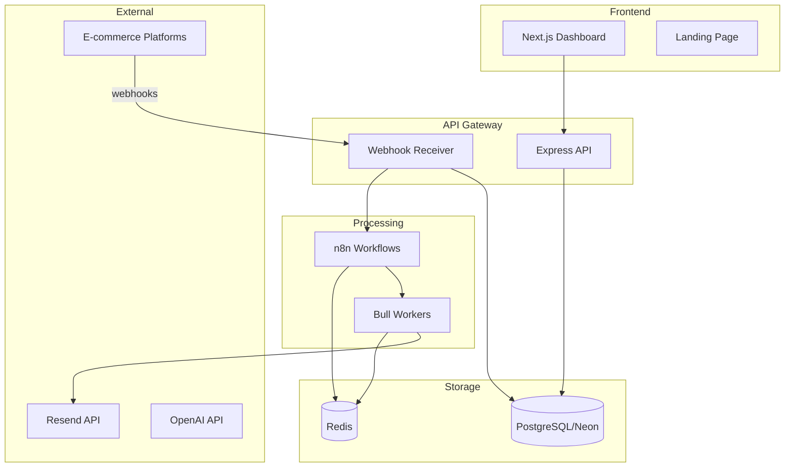

# Padrões do Sistema - Recovery SaaS

## 🏗 Arquitetura Geral

### Visão Macro


## 📐 Padrões Arquiteturais

### 1. Event-Driven Architecture
```typescript
// Todos os webhooks seguem o padrão de eventos
interface WebhookEvent {
  id: string;
  event: EventType;
  timestamp: string;
  organization_id: string;
  data: Record<string, any>;
  metadata: {
    version: string;
    source: string;
    retry_count: number;
  };
}

// Publicar evento
await redis.publish('webhook:received', JSON.stringify(event));

// Consumir evento
redis.subscribe('webhook:received', (message) => {
  const event = JSON.parse(message);
  await processEvent(event);
});
```

### 2. Repository Pattern
```typescript
// Base repository
abstract class BaseRepository<T> {
  constructor(protected prisma: PrismaClient) {}
  
  abstract findById(id: string): Promise<T | null>;
  abstract create(data: Partial<T>): Promise<T>;
  abstract update(id: string, data: Partial<T>): Promise<T>;
  abstract delete(id: string): Promise<boolean>;
}

// Implementação específica
class WebhookEventRepository extends BaseRepository<WebhookEvent> {
  async findById(id: string) {
    return this.prisma.webhookEvent.findUnique({
      where: { id }
    });
  }
  
  async findByOrganization(orgId: string, filters?: EventFilters) {
    return this.prisma.webhookEvent.findMany({
      where: {
        organization_id: orgId,
        ...this.buildWhereClause(filters)
      }
    });
  }
}
```

### 3. Service Layer Pattern
```typescript
// Serviços encapsulam lógica de negócio
class WebhookService {
  constructor(
    private eventRepo: WebhookEventRepository,
    private queueService: QueueService,
    private n8nService: N8nService
  ) {}
  
  async processWebhook(payload: WebhookPayload): Promise<void> {
    // 1. Validar
    const validated = await this.validate(payload);
    
    // 2. Salvar
    const event = await this.eventRepo.create(validated);
    
    // 3. Processar
    await this.n8nService.trigger(event);
    
    // 4. Enfileirar emails
    await this.queueService.scheduleEmails(event);
  }
}
```

### 4. Factory Pattern para Workers
```typescript
// Factory para criar workers específicos
class WorkerFactory {
  private workers = new Map<EventType, BaseWorker>();
  
  register(eventType: EventType, worker: BaseWorker) {
    this.workers.set(eventType, worker);
  }
  
  getWorker(eventType: EventType): BaseWorker {
    const worker = this.workers.get(eventType);
    if (!worker) {
      throw new Error(`No worker registered for ${eventType}`);
    }
    return worker;
  }
}

// Uso
const factory = new WorkerFactory();
factory.register('ABANDONED_CART', new AbandonedCartWorker());
factory.register('BANK_SLIP_EXPIRED', new BankSlipWorker());
```

### 5. Strategy Pattern para Templates
```typescript
// Interface para estratégias de template
interface TemplateStrategy {
  selectTemplate(event: WebhookEvent, emailNumber: number): string;
  personalizeContent(template: string, data: any): string;
}

// Implementações específicas
class AbandonedCartTemplateStrategy implements TemplateStrategy {
  selectTemplate(event: WebhookEvent, emailNumber: number) {
    const templates = {
      1: 'abandoned-cart-reminder',
      2: 'abandoned-cart-urgency',
      3: 'abandoned-cart-discount'
    };
    return templates[emailNumber] || 'default';
  }
}
```

## 🔒 Padrões de Segurança

### 1. HMAC Validation
```typescript
// Middleware para validar assinatura
export const validateWebhookSignature = (secret: string) => {
  return (req: Request, res: Response, next: NextFunction) => {
    const signature = req.headers['x-webhook-signature'] as string;
    const timestamp = req.headers['x-webhook-timestamp'] as string;
    
    // Prevenir replay attacks
    const currentTime = Date.now();
    const webhookTime = parseInt(timestamp);
    if (currentTime - webhookTime > 300000) { // 5 minutos
      return res.status(401).json({ error: 'Webhook expired' });
    }
    
    // Validar HMAC
    const payload = `${timestamp}.${JSON.stringify(req.body)}`;
    const expectedSignature = crypto
      .createHmac('sha256', secret)
      .update(payload)
      .digest('hex');
    
    if (signature !== expectedSignature) {
      return res.status(401).json({ error: 'Invalid signature' });
    }
    
    next();
  };
};
```

### 2. Rate Limiting por Tenant
```typescript
// Rate limiter customizado
const createTenantRateLimiter = () => {
  return rateLimit({
    windowMs: 60 * 1000, // 1 minuto
    max: (req) => {
      // Diferentes limites por plano
      const plan = req.organization?.plan || 'free';
      const limits = {
        free: 10,
        starter: 100,
        growth: 500,
        scale: 1000
      };
      return limits[plan];
    },
    keyGenerator: (req) => req.params.orgId,
    handler: (req, res) => {
      res.status(429).json({
        error: 'Rate limit exceeded',
        retryAfter: req.rateLimit.resetTime
      });
    }
  });
};
```

### 3. Input Sanitization
```typescript
// Schemas Zod para validação
const WebhookPayloadSchema = z.object({
  event: z.enum(EVENT_TYPES),
  timestamp: z.string().datetime(),
  organization_id: z.string().regex(/^org_[a-zA-Z0-9]{8,}$/),
  data: z.object({
    customer: z.object({
      email: z.string().email(),
      name: z.string().max(100),
      phone: z.string().optional()
    }),
    // ... resto do schema
  })
});

// Sanitizar dados antes de salvar
const sanitizeCustomerData = (data: any) => {
  return {
    ...data,
    email: data.email.toLowerCase().trim(),
    name: DOMPurify.sanitize(data.name),
    phone: data.phone?.replace(/\D/g, '')
  };
};
```

## 🔄 Padrões de Integração

### 1. n8n Integration Pattern
```typescript
// Serviço para integrar com n8n
class N8nIntegrationService {
  private webhookUrl: string;
  
  async triggerWorkflow(event: WebhookEvent): Promise<void> {
    const workflow = this.selectWorkflow(event.event);
    
    const response = await fetch(`${this.webhookUrl}/${workflow}`, {
      method: 'POST',
      headers: {
        'Content-Type': 'application/json',
        'X-N8N-API-KEY': process.env.N8N_API_KEY
      },
      body: JSON.stringify({
        event,
        metadata: {
          triggered_at: new Date().toISOString(),
          source: 'recovery-saas'
        }
      })
    });
    
    if (!response.ok) {
      throw new Error(`n8n workflow failed: ${response.statusText}`);
    }
  }
  
  private selectWorkflow(eventType: EventType): string {
    const workflows = {
      ABANDONED_CART: 'webhook/abandoned-cart-flow',
      BANK_SLIP_EXPIRED: 'webhook/bank-slip-flow',
      // ... outros mappings
    };
    return workflows[eventType];
  }
}
```

### 2. Queue Pattern com Bull
```typescript
// Configuração de filas por tipo de evento
class QueueManager {
  private queues: Map<string, Queue> = new Map();
  
  constructor(private redis: Redis) {
    this.initializeQueues();
  }
  
  private initializeQueues() {
    const queueConfigs = [
      { name: 'email-immediate', concurrency: 10 },
      { name: 'email-delayed', concurrency: 5 },
      { name: 'email-batch', concurrency: 2 }
    ];
    
    queueConfigs.forEach(config => {
      const queue = new Bull(config.name, {
        redis: this.redis,
        defaultJobOptions: {
          removeOnComplete: 100,
          removeOnFail: 1000,
          attempts: 3,
          backoff: {
            type: 'exponential',
            delay: 2000
          }
        }
      });
      
      this.queues.set(config.name, queue);
    });
  }
  
  async scheduleEmail(event: WebhookEvent, delay: number) {
    const queueName = delay === 0 ? 'email-immediate' : 'email-delayed';
    const queue = this.queues.get(queueName);
    
    await queue.add('send-email', {
      eventId: event.id,
      scheduledFor: new Date(Date.now() + delay * 60 * 1000)
    }, {
      delay: delay * 60 * 1000
    });
  }
}
```

## 📊 Padrões de Monitoramento

### 1. Structured Logging
```typescript
// Logger configurado
import winston from 'winston';

const logger = winston.createLogger({
  format: winston.format.combine(
    winston.format.timestamp(),
    winston.format.errors({ stack: true }),
    winston.format.json()
  ),
  defaultMeta: { service: 'recovery-saas' },
  transports: [
    new winston.transports.Console({
      format: winston.format.simple()
    }),
    new winston.transports.File({ 
      filename: 'error.log', 
      level: 'error' 
    })
  ]
});

// Uso padronizado
logger.info('Webhook received', {
  eventType: event.event,
  organizationId: event.organization_id,
  customerId: event.data.customer.id,
  timestamp: new Date().toISOString()
});
```

### 2. Metrics Collection
```typescript
// Prometheus metrics
import { Counter, Histogram, register } from 'prom-client';

const webhookCounter = new Counter({
  name: 'webhooks_received_total',
  help: 'Total number of webhooks received',
  labelNames: ['event_type', 'organization_id']
});

const processingDuration = new Histogram({
  name: 'webhook_processing_duration_seconds',
  help: 'Duration of webhook processing',
  labelNames: ['event_type'],
  buckets: [0.1, 0.5, 1, 2, 5]
});

// Uso
webhookCounter.inc({ 
  event_type: event.event, 
  organization_id: event.organization_id 
});

const timer = processingDuration.startTimer({ 
  event_type: event.event 
});
// ... processar
timer();
```

## 🧪 Padrões de Teste

### 1. Test Fixtures
```typescript
// Fixtures para testes
export const fixtures = {
  webhookPayload: (overrides = {}) => ({
    event: 'ABANDONED_CART',
    timestamp: new Date().toISOString(),
    organization_id: 'org_test123',
    data: {
      checkout_id: 'chk_test123',
      customer: {
        email: 'test@example.com',
        name: 'Test User'
      },
      ...overrides
    }
  }),
  
  organization: (overrides = {}) => ({
    id: 'org_test123',
    name: 'Test Organization',
    plan: 'growth',
    webhook_secret: 'test_secret',
    ...overrides
  })
};
```

### 2. Integration Test Pattern
```typescript
// Testes de integração
describe('Webhook Processing', () => {
  let app: Application;
  let redis: Redis;
  
  beforeAll(async () => {
    app = await createTestApp();
    redis = new Redis({ host: 'localhost', port: 6379 });
  });
  
  afterEach(async () => {
    await redis.flushall();
    await prisma.webhookEvent.deleteMany();
  });
  
  it('should process abandoned cart webhook', async () => {
    const payload = fixtures.webhookPayload();
    const signature = generateSignature(payload, 'test_secret');
    
    const response = await request(app)
      .post('/webhook/org_test123')
      .set('X-Webhook-Signature', signature)
      .send(payload);
    
    expect(response.status).toBe(200);
    
    // Verificar se foi salvo
    const event = await prisma.webhookEvent.findFirst({
      where: { organization_id: 'org_test123' }
    });
    expect(event).toBeDefined();
    
    // Verificar se foi enfileirado
    const jobs = await emailQueue.getJobs(['waiting']);
    expect(jobs).toHaveLength(3); // 3 emails programados
  });
});
```

## 🚀 Padrões de Deploy

### 1. Environment Configuration
```typescript
// Config centralizada
export const config = {
  env: process.env.NODE_ENV || 'development',
  port: parseInt(process.env.PORT || '3000'),
  database: {
    url: process.env.DATABASE_URL,
    maxConnections: parseInt(process.env.DB_MAX_CONNECTIONS || '10')
  },
  redis: {
    url: process.env.REDIS_URL,
    maxRetriesPerRequest: 3
  },
  n8n: {
    url: process.env.N8N_URL,
    apiKey: process.env.N8N_API_KEY
  },
  resend: {
    apiKey: process.env.RESEND_API_KEY,
    fromEmail: process.env.FROM_EMAIL || 'noreply@recovery-saas.com'
  },
  security: {
    jwtSecret: process.env.JWT_SECRET,
    bcryptRounds: 10
  }
};

// Validar config no startup
const validateConfig = () => {
  const required = [
    'DATABASE_URL',
    'REDIS_URL',
    'RESEND_API_KEY',
    'JWT_SECRET'
  ];
  
  const missing = required.filter(key => !process.env[key]);
  if (missing.length > 0) {
    throw new Error(`Missing required env vars: ${missing.join(', ')}`);
  }
};
```

### 2. Graceful Shutdown
```typescript
// Shutdown gracioso
class GracefulShutdown {
  private shutdownCallbacks: Array<() => Promise<void>> = [];
  
  register(callback: () => Promise<void>) {
    this.shutdownCallbacks.push(callback);
  }
  
  async shutdown() {
    console.log('Shutting down gracefully...');
    
    // Parar de aceitar novas conexões
    server.close();
    
    // Executar callbacks
    await Promise.all(
      this.shutdownCallbacks.map(cb => cb())
    );
    
    // Fechar conexões
    await prisma.$disconnect();
    await redis.quit();
    
    process.exit(0);
  }
}

// Registrar handlers
const shutdown = new GracefulShutdown();

shutdown.register(async () => {
  await emailQueue.close();
  console.log('Email queue closed');
});

process.on('SIGTERM', () => shutdown.shutdown());
process.on('SIGINT', () => shutdown.shutdown());
```

## 📚 Convenções de Código

### 1. Naming Conventions
```typescript
// Interfaces: PascalCase com prefixo I
interface IWebhookService { }

// Types: PascalCase
type EventType = 'ABANDONED_CART' | 'BANK_SLIP_EXPIRED';

// Classes: PascalCase
class WebhookHandler { }

// Functions/Methods: camelCase
function processWebhook() { }

// Constants: UPPER_SNAKE_CASE
const MAX_RETRY_ATTEMPTS = 3;

// Files: kebab-case
// webhook-handler.ts, email.service.ts
```

### 2. Error Handling
```typescript
// Custom errors
export class AppError extends Error {
  constructor(
    public statusCode: number,
    public message: string,
    public isOperational = true
  ) {
    super(message);
    Object.setPrototypeOf(this, AppError.prototype);
  }
}

// Uso consistente
try {
  await processWebhook(payload);
} catch (error) {
  if (error instanceof AppError) {
    logger.error('Operational error', { error });
    return res.status(error.statusCode).json({ 
      error: error.message 
    });
  }
  
  // Erro não esperado
  logger.error('Unexpected error', { error });
  return res.status(500).json({ 
    error: 'Internal server error' 
  });
}
```

---

**Última atualização**: 2024-12-29 