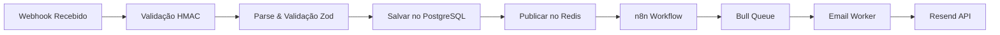

# Contexto de Webhooks - Recovery SaaS

## Status Geral: 3/12 webhooks implementados (25% completo)

## 🔄 Sistema de Tracking
- **Status**: ✅ 100% Funcional
- **Abertura de Email**: Rastreando com sucesso
- **Cliques em Links**: Rastreando com sucesso
- **Webhook do Resend**: Processando todos eventos

## 🔄 Arquitetura de Processamento



## 📝 Detalhamento por Webhook

### 1. ABANDONED_CART ✅ [100% completo]
**Descrição**: Carrinho abandonado pelo cliente
**Status**: Produção Ready
**Payload Recebido**:
```json
{
  "event": "ABANDONED_CART",
  "checkout_id": "Q8J1N6K3",
  "checkout_url": "http://example.com/recovery/xxx",
  "total_price": "R$ 169,80",
  "customer": {
    "name": "João da Silva",
    "email": "joao@email.com",
    "phone_number": "5511987654321"
  },
  "products": [{
    "name": "Produto X",
    "price": "R$ 119,90"
  }]
}
```
**Fluxo de Email Implementado**:
- ✅ Email 1 (2h): Lembrete gentil - "Você esqueceu algo especial"
- ✅ Email 2 (24h): Criando urgência - "Seus produtos podem acabar"
- ✅ Email 3 (72h): Última chance - "10% de desconto exclusivo"

**Tracking**:
- ✅ Taxa de abertura medida
- ✅ Taxa de cliques medida
- ✅ Conversões rastreáveis

**Código**: `/backend/src/workers/email.worker.ts`
**Templates**: `/backend/src/templates/emails/abandoned-cart-*.hbs`

### 2. PIX_EXPIRED 🟡 [50% completo]
**Descrição**: QR Code PIX expirou sem pagamento
**Handler**: ✅ Implementado
**Queue**: ✅ Configurado (delays: 15min, 2h)
**Templates**: 🟡 1 de 2 criados
  - ✅ pix-expired-renewal.hbs
  - 🔴 pix-expired-last-chance.hbs (pendente)
**Worker**: ✅ Funcionando
**Tracking**: ✅ Habilitado

### 3. BANK_SLIP_EXPIRED 🟡 [33% completo]
**Descrição**: Boleto bancário expirou sem pagamento
**Handler**: ✅ Implementado
**Queue**: ✅ Configurado (delays: 30min, 24h, 48h)
**Templates**: 🟡 1 de 3 criados
  - ✅ bank-slip-expired-renewal.hbs
  - 🔴 bank-slip-expired-urgency.hbs (pendente)
  - 🔴 bank-slip-expired-discount.hbs (pendente)
**Worker**: ✅ Funcionando
**Tracking**: ✅ Habilitado

### 4. SALE_REFUSED 🔴 [0% completo]
**Descrição**: Pagamento recusado pela operadora
**Próximos passos**:
- [ ] Criar handler
- [ ] Configurar delays (5min, 2h)
- [ ] Templates: retry, alternative-payment

### 5. SALE_APPROVED 🔴 [0% completo]
**Descrição**: Venda aprovada (confirmação)
**Próximos passos**:
- [ ] Criar handler
- [ ] Delay: imediato
- [ ] Template: order-confirmation

### 6. SALE_CHARGEBACK 🔴 [0% completo]
**Descrição**: Chargeback recebido
**Próximos passos**:
- [ ] Criar handler
- [ ] Delay: imediato
- [ ] Template: chargeback-notice

### 7. SALE_REFUNDED 🔴 [0% completo]
**Descrição**: Reembolso processado
**Próximos passos**:
- [ ] Criar handler
- [ ] Delay: imediato
- [ ] Template: refund-confirmation

### 8. BANK_SLIP_GENERATED 🔴 [0% completo]
**Descrição**: Boleto gerado (lembrete de pagamento)
**Próximos passos**:
- [ ] Criar handler
- [ ] Delays: 30min, 24h antes do vencimento
- [ ] Template: payment-instructions (com código de barras)

### 9. PIX_GENERATED 🔴 [0% completo]
**Descrição**: PIX gerado (enviar QR Code)
**Próximos passos**:
- [ ] Criar handler
- [ ] Delay: imediato
- [ ] Template: pix-qrcode (com QR Code e copia-cola)

### 10. SUBSCRIPTION_CANCELED 🔴 [0% completo]
**Descrição**: Assinatura cancelada (win-back)
**Próximos passos**:
- [ ] Criar handler
- [ ] Delays: 1h, 7 dias, 30 dias
- [ ] Templates: immediate-offer, week-later, final-offer

### 11. SUBSCRIPTION_EXPIRED 🔴 [0% completo]
**Descrição**: Assinatura expirada (renovação)
**Próximos passos**:
- [ ] Criar handler
- [ ] Delays: 7 dias antes, 1 dia antes, no dia
- [ ] Templates: renewal-reminder, urgent-renewal, expired-notice

### 12. SUBSCRIPTION_RENEWED 🔴 [0% completo]
**Descrição**: Assinatura renovada (confirmação)
**Próximos passos**:
- [ ] Criar handler
- [ ] Delay: imediato
- [ ] Template: renewal-confirmation

## 📊 Métricas de Implementação

### Por Categoria
- **Carrinho**: 1/1 (100%) ✅
- **Pagamento**: 1/4 (25%) 🟡
- **Venda**: 0/3 (0%) 🔴
- **Assinatura**: 0/3 (0%) 🔴

### Por Complexidade
- **Simples** (1 email): 0/3 (0%)
- **Médio** (2-3 emails): 3/7 (43%)
- **Complexo** (3+ emails): 0/2 (0%)

## 🔧 Configuração Técnica

### Delays Configurados
```typescript
const EVENT_DELAYS = {
  ABANDONED_CART: [2 * 60 * 60 * 1000, 24 * 60 * 60 * 1000, 72 * 60 * 60 * 1000],
  PIX_EXPIRED: [15 * 60 * 1000, 2 * 60 * 60 * 1000],
  BANK_SLIP_EXPIRED: [30 * 60 * 1000, 24 * 60 * 60 * 1000, 48 * 60 * 60 * 1000],
  // Outros a implementar...
};
```

### Sistema de Tracking
```typescript
// Todos os emails incluem:
headers: {
  'X-Track-Clicks': 'true',
  'X-Track-Opens': 'true',
}

// Status possíveis:
enum EmailStatus {
  PENDING = 'PENDING',
  SENT = 'SENT',
  DELIVERED = 'DELIVERED',
  OPENED = 'OPENED',
  CLICKED = 'CLICKED',
  BOUNCED = 'BOUNCED',
  FAILED = 'FAILED'
}
```

## 📝 Padrão de Implementação

Para implementar um novo webhook:

1. **Adicionar tipo ao schema**:
```typescript
// src/utils/webhook.validator.ts
eventType: z.enum([...existentes, 'NOVO_EVENTO'])
```

2. **Criar templates**:
```bash
touch backend/src/templates/emails/novo-evento-template.hbs
```

3. **Adicionar ao mapeamento**:
```typescript
// src/utils/email.templates.ts
NOVO_EVENTO: {
  delays: [delay1, delay2],
  templates: [
    { templateName: 'novo-evento-1', subject: 'Assunto 1' },
    { templateName: 'novo-evento-2', subject: 'Assunto 2' }
  ]
}
```

4. **Testar**:
```bash
node test-webhook.js NOVO_EVENTO
```

## 🔧 Configurações por Organização

```typescript
interface OrganizationWebhookConfig {
  organization_id: string;
  webhook_secret: string; // Para HMAC
  enabled_events: EventType[];
  email_delays: {
    [event: string]: number[]; // delays em minutos
  };
  custom_templates: boolean;
  ai_personalization: boolean;
  test_mode: boolean;
}
```

## 📊 Métricas de Performance

- **Taxa de Entrega**: Meta > 95%
- **Taxa de Abertura**: Meta > 25%
- **Taxa de Clique**: Meta > 5%
- **Taxa de Conversão**: Meta > 2%
- **Tempo de Processamento**: < 1s por webhook
- **Uptime**: 99.9%

## 🚀 Roadmap de Implementação

1. **Semana 1-2**: ABANDONED_CART + BANK_SLIP_EXPIRED
2. **Semana 3**: PIX_EXPIRED + SALE_REFUSED
3. **Semana 4**: SALE_APPROVED + PIX_GENERATED
4. **Semana 5**: BANK_SLIP_GENERATED + Assinaturas
5. **Semana 6**: Testes integrados + Otimizações 