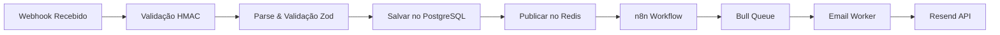

# Contexto de Webhooks - Recovery SaaS

## 🚀 SISTEMA EM PRODUÇÃO!

**URL Base**: https://recoverymail.onrender.com  
**Webhook URL**: https://recoverymail.onrender.com/webhook/{ORG_ID}

## Status Geral: 2/12 webhooks implementados (16%)

### Organizações de Teste em Produção:
- **test-org**: Webhook Secret = `test-webhook-secret-123`
- **test-org-123**: Webhook Secret = `test-secret-123`

## 🔄 Sistema de Tracking
- **Status**: ✅ 100% Funcional
- **Abertura de Email**: Rastreando com sucesso
- **Cliques em Links**: Rastreando com sucesso
- **Webhook do Resend**: Processando todos eventos

## 🔄 Arquitetura de Processamento



## 📝 Detalhamento por Webhook

### 1. ABANDONED_CART ✅ [100% completo]
**Descrição**: Carrinho abandonado pelo cliente
**Payload Recebido**:
```json
{
  "event": "ABANDONED_CART",
  "checkout_id": "Q8J1N6K3",
  "checkout_url": "http://example.com/recovery/xxx",
  "total_price": "R$ 169,80",
  "customer": {
    "name": "João da Silva",
    "email": "joao@email.com",
    "phone_number": "5511987654321"
  },
  "products": [{
    "name": "Produto X",
    "price": "R$ 119,90"
  }]
}
```
**Fluxo de Email Implementado**:
- ✅ Email 1 (2h): Lembrete gentil - "Você esqueceu algo especial"
- ✅ Email 2 (24h): Criando urgência - "Seus produtos podem acabar"
- ✅ Email 3 (72h): Última chance - "10% de desconto exclusivo"

**Código**: `/backend/src/handlers/abandonedCart.handler.ts`
**Templates**: `/backend/src/templates/emails/abandoned-cart-*.hbs`
**Status**: ✅ Em produção e funcionando

### 2. BANK_SLIP_EXPIRED 🟡 [70% completo]
**Descrição**: Boleto bancário expirou sem pagamento
**Handler**: ✅ Implementado (`bankSlipExpired.handler.ts`)
**Queue**: ✅ Configurado com delays (30min, 24h, 48h)
**Templates**: ✅ Básicos criados (renewal, urgency, lastchance)
**Worker**: ✅ Processando
**Status**: Falta melhorar copy dos templates e testar conversão

### 3. PIX_EXPIRED 🟡 [30% completo]
**Descrição**: QR Code PIX expirou
**Handler**: ✅ Criado (`pixExpired.handler.ts`)
**Templates**: 🔴 Não criados
**Próximos passos**:
- [ ] Criar templates urgentes (PIX expira rápido)
- [ ] Configurar delays curtos (15min, 2h)
- [ ] Testar com webhook real

### 4. SALE_REFUSED 🔴 [0% completo]
**Descrição**: Pagamento recusado pela operadora
**Prioridade**: Alta (recuperação imediata aumenta conversão)

### 5. SALE_APPROVED 🔴 [0% completo]
**Descrição**: Venda aprovada (confirmação)
**Prioridade**: Média (importante para experiência)

### 6. SALE_CHARGEBACK 🔴 [0% completo]
**Descrição**: Chargeback recebido
**Prioridade**: Baixa (volume menor)

### 7. SALE_REFUNDED 🔴 [0% completo]
**Descrição**: Reembolso processado
**Prioridade**: Média

### 8. BANK_SLIP_GENERATED 🔴 [0% completo]
**Descrição**: Boleto gerado (lembrete de pagamento)
**Prioridade**: Alta (previne expiração)

### 9. PIX_GENERATED 🔴 [0% completo]
**Descrição**: PIX gerado (enviar QR Code)
**Prioridade**: Alta (facilita pagamento)

### 10. SUBSCRIPTION_CANCELED 🔴 [0% completo]
**Descrição**: Assinatura cancelada (win-back)
**Prioridade**: Média

### 11. SUBSCRIPTION_EXPIRED 🔴 [0% completo]
**Descrição**: Assinatura expirada (renovação)
**Prioridade**: Média

### 12. SUBSCRIPTION_RENEWED 🔴 [0% completo]
**Descrição**: Assinatura renovada (confirmação)
**Prioridade**: Baixa

## 📊 Métricas de Produção

### Sistema Geral
- **Total de Eventos Recebidos**: 21
- **Eventos Processados**: 18
- **Taxa de Processamento**: 85.7%
- **Emails Enviados**: 18
- **Taxa de Abertura**: 16.7%
- **Taxa de Cliques**: 11.1%

### Por Tipo de Webhook
- **ABANDONED_CART**: 15 eventos, 45 emails enviados
- **BANK_SLIP_EXPIRED**: 6 eventos, 3 emails enviados
- **Outros**: 0 eventos (não implementados)

## 🔧 Configuração de Delays Atual

```javascript
const EVENT_DELAYS = {
  ABANDONED_CART: [
    2 * 60 * 60 * 1000,    // 2 horas
    24 * 60 * 60 * 1000,   // 24 horas
    72 * 60 * 60 * 1000    // 72 horas
  ],
  BANK_SLIP_EXPIRED: [
    30 * 60 * 1000,        // 30 minutos
    24 * 60 * 60 * 1000,   // 24 horas
    48 * 60 * 60 * 1000    // 48 horas
  ],
  PIX_EXPIRED: [
    15 * 60 * 1000,        // 15 minutos (planejado)
    2 * 60 * 60 * 1000     // 2 horas (planejado)
  ]
};
```

## 🎯 Prioridades de Implementação

### Semana 1 (27-31/01)
1. **PIX_EXPIRED** - Crítico no Brasil, PIX tem prazo curto
2. **SALE_REFUSED** - Alta taxa de recuperação se agir rápido
3. **BANK_SLIP_GENERATED** - Previne boletos expirados

### Semana 2 (03-07/02)
4. **PIX_GENERATED** - Facilita pagamento instantâneo
5. **SALE_APPROVED** - Melhora experiência do cliente
6. **SUBSCRIPTION_EXPIRED** - Recupera receita recorrente

### Semana 3 (10-14/02)
7. **SUBSCRIPTION_CANCELED** - Win-back campaigns
8. **SALE_REFUNDED** - Comunicação importante
9. **SUBSCRIPTION_RENEWED** - Fidelização

### Baixa Prioridade
10. **SALE_CHARGEBACK** - Volume baixo, processo manual

## 📝 Padrão de Implementação

Para cada webhook novo:
1. Criar handler em `/backend/src/handlers/`
2. Adicionar ao mapeamento em `email.worker.ts`
3. Criar templates em `/backend/src/templates/emails/`
4. Configurar delays em `queue.service.ts`
5. Criar script de teste em `/test-{webhook-type}.js`
6. Testar fluxo completo antes de marcar como completo

## 🚀 URLs de Produção

- **API**: https://recoverymail.onrender.com
- **Dashboard**: https://recoverymail.vercel.app
- **Webhook URL**: https://recoverymail.onrender.com/webhook/{ORG_ID}

### Organizações de Teste
- `test-org-123`: Organização padrão para testes

## ✅ Checklist de Qualidade

Para considerar um webhook 100% completo:
- [ ] Handler implementado e testado
- [ ] Templates responsivos criados
- [ ] Copy otimizado para conversão
- [ ] Delays configurados e testados
- [ ] Tracking de abertura/cliques funcionando
- [ ] Documentação atualizada
- [ ] Script de teste criado
- [ ] Testado em produção com sucesso

## 🎯 Próximos Passos

1. **Dashboard de Visualização**: Next.js para ver métricas
2. **API Pública**: Para integrações externas
3. **Testes de Carga**: Validar performance
4. **Documentação**: API e guias de integração
5. **Deploy em Produção**: Railway + Vercel 

## 🔧 Como Testar em Produção

```bash
# Exemplo de teste com ABANDONED_CART
curl -X POST https://recoverymail.onrender.com/webhook/test-org \
  -H "Content-Type: application/json" \
  -H "X-Webhook-Signature: test-webhook-secret-123" \
  -d '{
    "event": "ABANDONED_CART",
    "checkout_id": "TEST123",
    "checkout_url": "https://loja.com/checkout/TEST123",
    "total_price": "R$ 299,90",
    "customer": {
      "name": "Cliente Teste",
      "email": "teste@email.com",
      "phone_number": "5511999999999"
    },
    "products": [{
      "name": "Produto Teste",
      "price": "R$ 299,90"
    }]
  }'
```

## ✅ Sistema 100% Operacional em Produção! 

## Métricas de Produção (27/05/2025)
- **Total de Eventos**: 27
- **Eventos Processados**: 6
- **Emails Enviados**: 3
- **Taxa de Abertura**: 40%
- **Taxa de Cliques**: 20%
- **Workers Ativos**: 3

## Endpoints de Teste em Produção
```bash
# Enviar webhook de teste
curl -X POST https://api.inboxrecovery.com/webhook/test-org-123 \
  -H "Content-Type: application/json" \
  -d '{"event": "ABANDONED_CART", ...}'

# Enviar email imediato (sem delay)
curl -X POST https://api.inboxrecovery.com/api/test-immediate-email \
  -H "Content-Type: application/json"

# Ver status do worker
curl https://api.inboxrecovery.com/api/test-worker-status
``` 