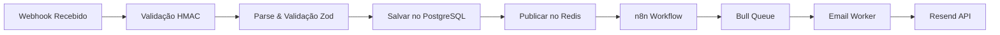

# Contexto de Webhooks - Recovery SaaS

## 📊 Status Geral: 0/12 webhooks implementados

## 🔄 Arquitetura de Processamento



## 📝 Detalhamento por Webhook

### 1. ABANDONED_CART 🔴 [0% completo]
**Descrição**: Carrinho abandonado pelo cliente  
**Prioridade**: ALTA (40% dos casos)  
**Timing**: 2h → 24h → 72h

**Payload Esperado**:
```json
{
  "event": "ABANDONED_CART",
  "timestamp": "2024-01-15T10:30:00Z",
  "organization_id": "org_abc123",
  "data": {
    "checkout_id": "chk_Q8J1N6K3",
    "checkout_url": "https://loja.com/checkout/Q8J1N6K3",
    "abandoned_at": "2024-01-15T10:30:00Z",
    "currency": "BRL",
    "total_price": 169.80,
    "subtotal": 149.90,
    "shipping": 19.90,
    "discount": 0,
    "customer": {
      "id": "cus_xyz789",
      "name": "João da Silva",
      "email": "joao@email.com",
      "phone": "+5511987654321",
      "document": "123.456.789-00"
    },
    "items": [
      {
        "product_id": "prod_123",
        "name": "Tênis Runner Pro",
        "variant": "Preto - 42",
        "quantity": 1,
        "price": 149.90,
        "image_url": "https://cdn.loja.com/tenis-runner-pro.jpg"
      }
    ],
    "utm_params": {
      "source": "google",
      "medium": "cpc",
      "campaign": "black_friday"
    }
  }
}
```

**Fluxo de Emails**:
1. **Email 1 (2h)**: "Você esqueceu algo especial 💝"
   - Tom: Amigável e prestativo
   - CTA: "Finalizar compra"
   - Elementos: Produtos, frete grátis reminder

2. **Email 2 (24h)**: "Seus produtos podem acabar ⏰"
   - Tom: Urgência moderada
   - CTA: "Garantir produtos"
   - Elementos: Estoque limitado, reviews

3. **Email 3 (72h)**: "Última chance + 10% OFF 🎁"
   - Tom: Urgência alta + incentivo
   - CTA: "Usar cupom"
   - Elementos: Cupom exclusivo, timer

**Integrações n8n**:
- [ ] Node de recebimento webhook
- [ ] Node de enriquecimento (buscar dados adicionais)
- [ ] Node de decisão (A/B test)
- [ ] Node de delay programado
- [ ] Node de envio para fila

---

### 2. BANK_SLIP_EXPIRED 🔴 [0% completo]
**Descrição**: Boleto bancário expirou sem pagamento  
**Prioridade**: ALTA (30% dos casos)  
**Timing**: Imediato → 6h → 24h

**Payload Esperado**:
```json
{
  "event": "BANK_SLIP_EXPIRED",
  "timestamp": "2024-01-15T00:00:00Z",
  "organization_id": "org_abc123",
  "data": {
    "order_id": "ord_987654",
    "bank_slip_id": "bol_456789",
    "expired_at": "2024-01-15T00:00:00Z",
    "original_due_date": "2024-01-14",
    "amount": 299.90,
    "customer": {
      "id": "cus_xyz789",
      "name": "Maria Santos",
      "email": "maria@email.com",
      "phone": "+5521998765432"
    },
    "order_details": {
      "items_count": 3,
      "created_at": "2024-01-10T15:30:00Z"
    }
  }
}
```

**Fluxo de Emails**:
1. **Email 1 (Imediato)**: "Ops! Seu boleto venceu 📋"
   - Novo boleto anexo
   - PIX como alternativa
   - Parcelamento disponível

2. **Email 2 (6h)**: "Que tal pagar via PIX? ⚡"
   - QR Code PIX
   - 5% desconto para PIX
   - Aprovação instantânea

3. **Email 3 (24h)**: "Última chance de garantir seus produtos"
   - Link para novo boleto
   - Opções de pagamento
   - Produtos podem esgotar

---

### 3. PIX_EXPIRED 🔴 [0% completo]
**Descrição**: QR Code PIX expirou (geralmente 30min-2h)  
**Prioridade**: MÉDIA  
**Timing**: 15min → 2h

**Payload Esperado**:
```json
{
  "event": "PIX_EXPIRED",
  "timestamp": "2024-01-15T11:00:00Z",
  "organization_id": "org_abc123",
  "data": {
    "order_id": "ord_123789",
    "pix_id": "pix_789456",
    "qr_code": "00020126330014BR.GOV.BCB.PIX...",
    "qr_code_url": "https://api.loja.com/pix/qr/pix_789456.png",
    "expired_at": "2024-01-15T11:00:00Z",
    "created_at": "2024-01-15T10:30:00Z",
    "amount": 89.90,
    "customer": {
      "id": "cus_abc456",
      "name": "Carlos Oliveira",
      "email": "carlos@email.com"
    }
  }
}
```

**Fluxo de Emails**:
1. **Email 1 (15min)**: "Seu PIX expirou - Gere um novo! 🔄"
   - Novo QR Code
   - Botão "Gerar novo PIX"
   - Urgência moderada

2. **Email 2 (2h)**: "Finalize sua compra de R$ 89,90"
   - Múltiplas opções de pagamento
   - Benefícios do produto
   - Garantia de satisfação

---

### 4. SALE_REFUSED 🔴 [0% completo]
**Descrição**: Pagamento recusado pela operadora  
**Prioridade**: ALTA  
**Timing**: Imediato → 2h → 24h

**Payload Esperado**:
```json
{
  "event": "SALE_REFUSED",
  "timestamp": "2024-01-15T14:22:00Z",
  "organization_id": "org_abc123",
  "data": {
    "order_id": "ord_456123",
    "transaction_id": "trx_789123",
    "refused_at": "2024-01-15T14:22:00Z",
    "reason_code": "insufficient_funds",
    "reason_message": "Saldo insuficiente",
    "payment_method": "credit_card",
    "amount": 450.00,
    "customer": {
      "id": "cus_def789",
      "name": "Ana Paula",
      "email": "ana@email.com"
    },
    "card_info": {
      "last_digits": "4321",
      "brand": "mastercard"
    }
  }
}
```

**Fluxo de Emails**:
1. **Email 1 (Imediato)**: "Houve um problema com seu pagamento 💳"
   - Explicação clara do problema
   - Link para tentar novamente
   - Sugestão de outro cartão

2. **Email 2 (2h)**: "Que tal tentar outro método de pagamento?"
   - PIX com desconto
   - Boleto parcelado
   - Outros cartões

3. **Email 3 (24h)**: "Seus produtos ainda estão reservados"
   - Urgência (reserva expira)
   - Múltiplas opções
   - Suporte disponível

---

### 5. SALE_APPROVED 🔴 [0% completo]
**Descrição**: Venda aprovada com sucesso  
**Prioridade**: MÉDIA  
**Timing**: Imediato

**Payload Esperado**:
```json
{
  "event": "SALE_APPROVED",
  "timestamp": "2024-01-15T15:45:00Z",
  "organization_id": "org_abc123",
  "data": {
    "order_id": "ord_789456",
    "transaction_id": "trx_456789",
    "approved_at": "2024-01-15T15:45:00Z",
    "payment_method": "credit_card",
    "installments": 3,
    "amount": 899.70,
    "shipping": {
      "method": "express",
      "estimated_days": 2,
      "tracking_code": null
    },
    "customer": {
      "id": "cus_ghi123",
      "name": "Roberto Silva",
      "email": "roberto@email.com"
    }
  }
}
```

**Fluxo de Email**:
1. **Email Único**: "Pedido confirmado! 🎉"
   - Resumo do pedido
   - Prazo de entrega
   - Próximos passos
   - Cross-sell sutil

---

### 6. SALE_CHARGEBACK 🔴 [0% completo]
**Descrição**: Cliente contestou a compra  
**Prioridade**: BAIXA  
**Timing**: Imediato

**Payload Esperado**:
```json
{
  "event": "SALE_CHARGEBACK",
  "timestamp": "2024-01-15T09:00:00Z",
  "organization_id": "org_abc123",
  "data": {
    "order_id": "ord_321654",
    "transaction_id": "trx_654321",
    "chargeback_id": "cbk_123456",
    "reason": "fraud",
    "amount": 1299.00,
    "status": "pending",
    "customer": {
      "id": "cus_jkl456",
      "name": "Cliente Exemplo",
      "email": "cliente@email.com"
    }
  }
}
```

**Fluxo de Email**:
1. **Email Único**: "Sobre sua contestação"
   - Tom profissional
   - Processo de resolução
   - Documentos necessários
   - Prazo de resposta

---

### 7. SALE_REFUNDED 🔴 [0% completo]
**Descrição**: Reembolso processado  
**Prioridade**: BAIXA  
**Timing**: Imediato

**Payload Esperado**:
```json
{
  "event": "SALE_REFUNDED",
  "timestamp": "2024-01-15T16:30:00Z",
  "organization_id": "org_abc123",
  "data": {
    "order_id": "ord_147258",
    "refund_id": "ref_369258",
    "amount": 199.90,
    "reason": "customer_request",
    "refund_method": "original_payment",
    "estimated_days": 5,
    "customer": {
      "id": "cus_mno789",
      "name": "Fernanda Costa",
      "email": "fernanda@email.com"
    }
  }
}
```

**Fluxo de Email**:
1. **Email Único**: "Reembolso processado ✅"
   - Valor e prazo
   - Motivo do reembolso
   - Pesquisa de satisfação
   - Cupom de retorno

---

### 8. BANK_SLIP_GENERATED 🔴 [0% completo]
**Descrição**: Boleto gerado, aguardando pagamento  
**Prioridade**: MÉDIA  
**Timing**: 2h → 24h → 48h antes do vencimento

**Payload Esperado**:
```json
{
  "event": "BANK_SLIP_GENERATED",
  "timestamp": "2024-01-15T10:00:00Z",
  "organization_id": "org_abc123",
  "data": {
    "order_id": "ord_852963",
    "bank_slip_id": "bol_741852",
    "bar_code": "34191.79001 01043.510047 91020.150008 1 91230000019990",
    "pdf_url": "https://api.loja.com/boleto/bol_741852.pdf",
    "due_date": "2024-01-18",
    "amount": 349.90,
    "customer": {
      "id": "cus_pqr123",
      "name": "Lucas Mendes",
      "email": "lucas@email.com"
    }
  }
}
```

**Fluxo de Emails**:
1. **Email 1 (2h)**: "Seu boleto está pronto! 📄"
   - PDF anexo
   - Código de barras
   - Data de vencimento destacada

2. **Email 2 (24h antes)**: "Lembrete: Boleto vence amanhã"
   - Urgência moderada
   - Link rápido
   - PIX como alternativa

3. **Email 3 (dia do vencimento)**: "Hoje é o último dia!"
   - Urgência alta
   - Múltiplas CTAs
   - Consequências do não pagamento

---

### 9. PIX_GENERATED 🔴 [0% completo]
**Descrição**: QR Code PIX gerado  
**Prioridade**: ALTA  
**Timing**: 15min → 45min

**Payload Esperado**:
```json
{
  "event": "PIX_GENERATED",
  "timestamp": "2024-01-15T11:30:00Z",
  "organization_id": "org_abc123",
  "data": {
    "order_id": "ord_963852",
    "pix_id": "pix_159753",
    "qr_code": "00020126330014BR.GOV.BCB.PIX...",
    "qr_code_url": "https://api.loja.com/pix/qr/pix_159753.png",
    "expires_at": "2024-01-15T12:30:00Z",
    "amount": 129.90,
    "customer": {
      "id": "cus_stu456",
      "name": "Patricia Lima",
      "email": "patricia@email.com"
    }
  }
}
```

**Fluxo de Emails**:
1. **Email 1 (15min)**: "Seu PIX está esperando! 📱"
   - QR Code grande
   - Passo a passo
   - Timer de expiração

2. **Email 2 (45min)**: "⏰ Seu PIX expira em 15 minutos"
   - Urgência máxima
   - QR Code
   - Botão "Pagar agora"

---

### 10. SUBSCRIPTION_CANCELED 🔴 [0% completo]
**Descrição**: Assinatura cancelada - win-back  
**Prioridade**: MÉDIA  
**Timing**: Imediato → 7d → 30d

**Payload Esperado**:
```json
{
  "event": "SUBSCRIPTION_CANCELED",
  "timestamp": "2024-01-15T09:15:00Z",
  "organization_id": "org_abc123",
  "data": {
    "subscription_id": "sub_789123",
    "canceled_at": "2024-01-15T09:15:00Z",
    "reason": "too_expensive",
    "plan": {
      "name": "Premium",
      "price": 99.90,
      "interval": "monthly"
    },
    "customer": {
      "id": "cus_vwx789",
      "name": "Ricardo Alves",
      "email": "ricardo@email.com",
      "member_since": "2023-01-15"
    },
    "usage_stats": {
      "last_login": "2024-01-10",
      "features_used": ["reports", "automation"]
    }
  }
}
```

**Fluxo de Emails**:
1. **Email 1 (Imediato)**: "Sentiremos sua falta 😢"
   - Confirmar cancelamento
   - Pesquisa de motivo
   - Oferta de ajuda

2. **Email 2 (7d)**: "Que tal um desconto especial?"
   - 30% off por 3 meses
   - Novidades perdidas
   - Depoimentos

3. **Email 3 (30d)**: "Última oferta exclusiva"
   - 50% off primeiro mês
   - Benefícios destacados
   - Urgência

---

### 11. SUBSCRIPTION_EXPIRED 🔴 [0% completo]
**Descrição**: Assinatura expirou - renovação  
**Prioridade**: ALTA  
**Timing**: 7d antes → 3d antes → No dia

**Payload Esperado**:
```json
{
  "event": "SUBSCRIPTION_EXPIRED",
  "timestamp": "2024-01-15T00:00:00Z",
  "organization_id": "org_abc123",
  "data": {
    "subscription_id": "sub_456789",
    "expired_at": "2024-01-15T00:00:00Z",
    "plan": {
      "name": "Business",
      "price": 299.90,
      "interval": "monthly"
    },
    "customer": {
      "id": "cus_yza123",
      "name": "Empresa XYZ",
      "email": "financeiro@empresa.com"
    },
    "can_renew": true,
    "renewal_url": "https://app.loja.com/renew/sub_456789"
  }
}
```

**Fluxo de Emails**:
1. **Email 1 (7d antes)**: "Sua assinatura expira em 7 dias"
   - Lembrete amigável
   - Benefícios atuais
   - Link renovação

2. **Email 2 (3d antes)**: "Apenas 3 dias restantes!"
   - Urgência crescente
   - O que será perdido
   - Desconto renovação

3. **Email 3 (No dia)**: "Hoje é o último dia!"
   - Urgência máxima
   - Consequências
   - Oferta especial

---

### 12. SUBSCRIPTION_RENEWED 🔴 [0% completo]
**Descrição**: Assinatura renovada com sucesso  
**Prioridade**: BAIXA  
**Timing**: Imediato

**Payload Esperado**:
```json
{
  "event": "SUBSCRIPTION_RENEWED",
  "timestamp": "2024-01-15T10:00:00Z",
  "organization_id": "org_abc123",
  "data": {
    "subscription_id": "sub_321987",
    "renewed_at": "2024-01-15T10:00:00Z",
    "next_billing_date": "2024-02-15",
    "plan": {
      "name": "Enterprise",
      "price": 999.90,
      "interval": "monthly"
    },
    "customer": {
      "id": "cus_bcd456",
      "name": "Grande Empresa SA",
      "email": "admin@grandeempresa.com"
    },
    "invoice_url": "https://app.loja.com/invoice/inv_123456"
  }
}
```

**Fluxo de Email**:
1. **Email Único**: "Assinatura renovada! ✨"
   - Agradecimento
   - Próxima cobrança
   - Novidades do plano
   - Link da fatura

---

## 🔧 Configurações por Organização

```typescript
interface OrganizationWebhookConfig {
  organization_id: string;
  webhook_secret: string; // Para HMAC
  enabled_events: EventType[];
  email_delays: {
    [event: string]: number[]; // delays em minutos
  };
  custom_templates: boolean;
  ai_personalization: boolean;
  test_mode: boolean;
}
```

## 📊 Métricas de Performance

- **Taxa de Entrega**: Meta > 95%
- **Taxa de Abertura**: Meta > 25%
- **Taxa de Clique**: Meta > 5%
- **Taxa de Conversão**: Meta > 2%
- **Tempo de Processamento**: < 1s por webhook
- **Uptime**: 99.9%

## 🚀 Roadmap de Implementação

1. **Semana 1-2**: ABANDONED_CART + BANK_SLIP_EXPIRED
2. **Semana 3**: PIX_EXPIRED + SALE_REFUSED
3. **Semana 4**: SALE_APPROVED + PIX_GENERATED
4. **Semana 5**: BANK_SLIP_GENERATED + Assinaturas
5. **Semana 6**: Testes integrados + Otimizações 